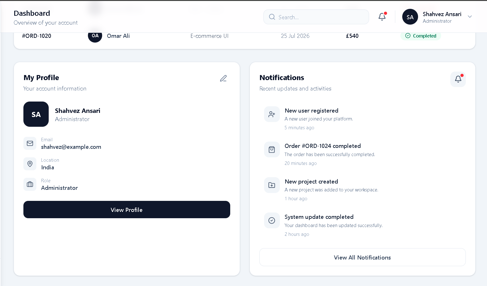
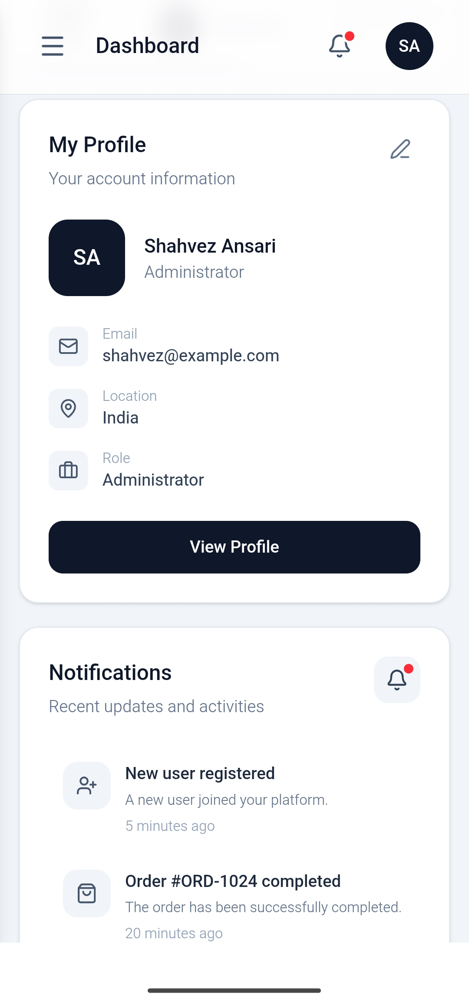
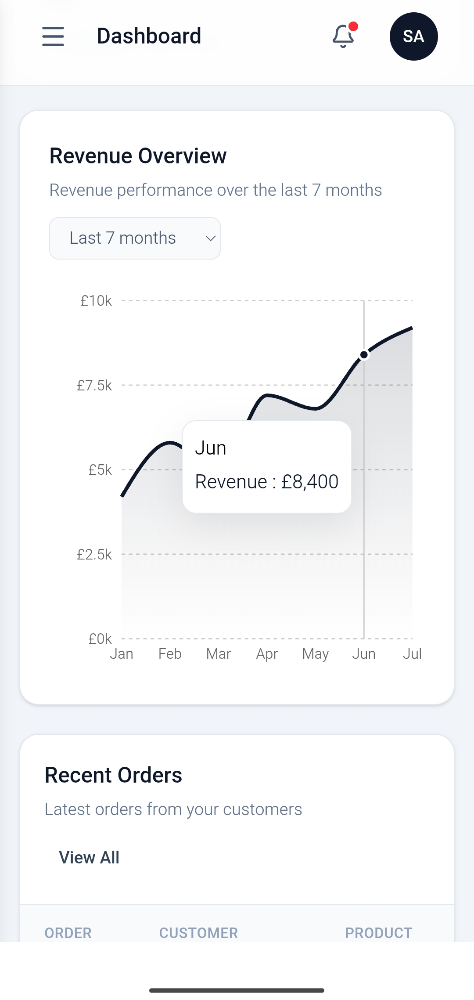

# AdminPro — React Admin Dashboard 🚀

A modern, responsive, and professional Admin Dashboard built using **React and Vite**.

This project was developed as part of a **Frontend Internship Task** to demonstrate component-based architecture, reusable React components, responsive UI development, React Hooks, dashboard layout principles, and modern frontend development practices.

---

## 🌐 Live Demo

**Live Application:**
https://admin-dashboard-2026-tau.vercel.app/

---

## 📸 Project Screenshots

The dashboard has been designed and tested across desktop and mobile screen sizes, with responsive navigation, cards, charts, tables, profile sections, and notifications.

### 🖥️ Desktop Dashboard


### 📋 Recent Orders


### 👤 Profile & Notifications



### 📱 Mobile Dashboard


### 👤 Mobile Profile & Notifications



### 📊 Mobile Revenue Analytics



### 📱 Mobile Responsive Sidebar


## ✨ Features

* 📊 Dashboard overview with statistics
* 👥 Users statistics
* 💰 Revenue statistics
* 🛒 Orders statistics
* 📁 Projects statistics
* 📈 Revenue analytics chart
* 📋 Recent orders table
* 👤 User profile card
* 🔔 Notifications section
* 🔍 Search interface
* 📱 Responsive mobile sidebar
* 🖥️ Desktop, tablet, and mobile responsive design
* ✨ Smooth and lightweight UI animations
* 🎨 Clean and professional interface
* 🧩 Reusable React components
* ⚡ Fast Vite development environment

---

## 🛠️ Tech Stack

### Frontend

* **React**
* **JavaScript**
* **Vite**
* **Tailwind CSS**

### Libraries

* **Lucide React** — Icons
* **Recharts** — Analytics and dashboard charts

### Development & Deployment

* **ESLint**
* **Git**
* **GitHub**
* **Vercel**

---

## 🧠 React Concepts Demonstrated

This project focuses on practical React development concepts, including:

* Functional Components
* React Hooks
* `useState`
* `useEffect` where applicable
* Component-based architecture
* Reusable UI components
* Props and component data flow
* State-driven UI interactions
* Responsive design
* Organized project structure

---

## 🧩 Component Architecture

The dashboard is divided into reusable components instead of keeping the entire interface inside one large component.

Examples include:

* `Sidebar` — Dashboard navigation
* `Navbar` — Top navigation and search
* `StatCard` — Reusable statistics cards
* `AnalyticsChart` — Revenue analytics visualization
* `RecentOrders` — Recent order information
* `ProfileCard` — User profile information
* `Notifications` — Notification interface

This structure makes the application easier to maintain, update, and scale.

---

## 📂 Project Structure

```text
admin-dashboard/
│
├── public/
│
├── src/
│   │
│   ├── components/
│   │   ├── AnalyticsChart.jsx
│   │   ├── Navbar.jsx
│   │   ├── Notifications.jsx
│   │   ├── ProfileCard.jsx
│   │   ├── RecentOrders.jsx
│   │   ├── Sidebar.jsx
│   │   └── StatCard.jsx
│   │
│   ├── data/
│   │   └── dashboardData.js
│   │
│   ├── pages/
│   │   └── Dashboard.jsx
│   │
│   ├── App.jsx
│   ├── index.css
│   └── main.jsx
│
├── .gitignore
├── index.html
├── package.json
├── package-lock.json
├── vite.config.js
└── README.md
```

---

## ⚙️ Getting Started

Follow these steps to run the project locally.

### 1. Clone the repository

```bash
git clone https://github.com/Shahvez1234/admin-dashboard.git
```

### 2. Navigate to the project directory

```bash
cd admin-dashboard
```

### 3. Install dependencies

```bash
npm install
```

### 4. Start the development server

```bash
npm run dev
```

The application will be available on the local development URL provided by Vite.

---

## 🏗️ Production Build

To create a production build:

```bash
npm run build
```

To preview the production build locally:

```bash
npm run preview
```

---

## 📱 Responsive Design

The dashboard has been designed and tested for:

* 📱 Mobile devices
* 📲 Tablets
* 💻 Laptops
* 🖥️ Desktop screens

The sidebar, navigation, cards, tables, charts, and dashboard layout adapt according to the available screen size.

---

## 🚀 Deployment

The project is deployed using **Vercel**.

### Deployment URL

https://admin-dashboard-2026-tau.vercel.app/

Every new push to the connected GitHub repository can trigger a new deployment through Vercel.

---

## 📚 Learning Outcomes

Through this project, I gained practical experience in:

* Building component-driven React applications
* Creating reusable UI components
* Managing UI state using React Hooks
* Structuring a scalable frontend project
* Designing responsive layouts
* Building professional dashboard interfaces
* Working with charts and icon libraries
* Using Git and GitHub for version control
* Deploying React applications using Vercel

---

## 🔮 Future Improvements

Possible future enhancements include:

* Authentication and authorization
* Backend API integration
* Real-time dashboard data
* Advanced filtering and sorting
* Dark/light theme switching
* User management
* Advanced analytics
* Database integration

---

## 👨‍💻 Author

**Shahvez Ansari**

Computer Engineering Student

### Project Links

* **Live Demo:** https://admin-dashboard-2026-tau.vercel.app/
* **GitHub:** https://github.com/Shahvez1234/admin-dashboard

---

## 📄 Internship Task

This project was developed as part of a **Frontend Internship Task — React Dashboard Development**.

The objective was to build a modern, responsive, component-driven Admin Dashboard while demonstrating practical React development and frontend engineering skills.
