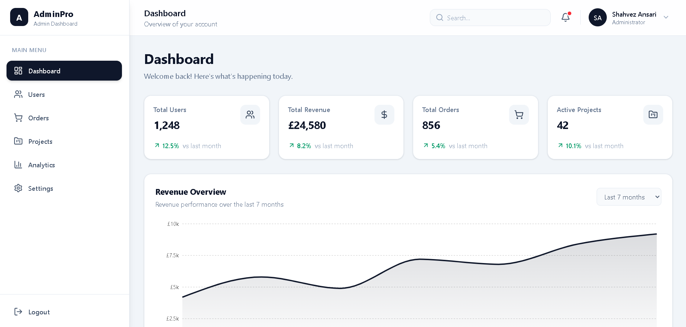
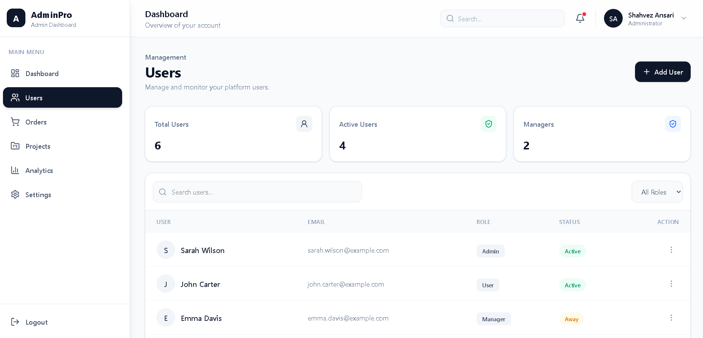
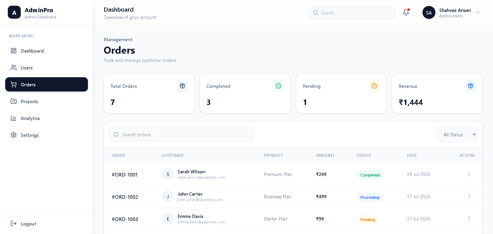
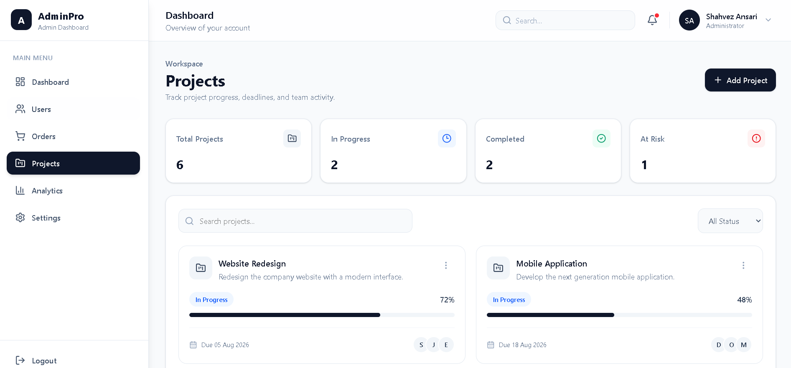
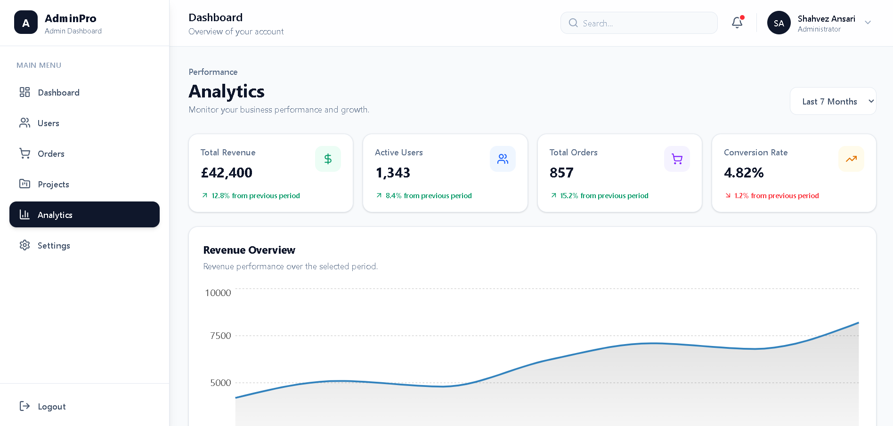
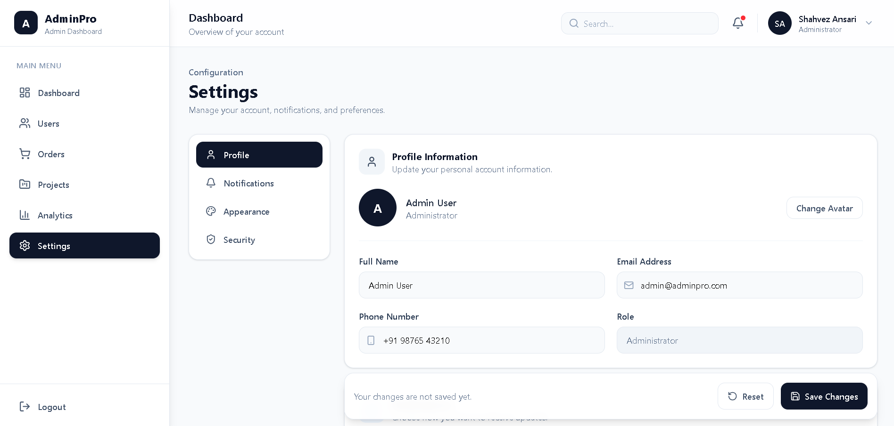
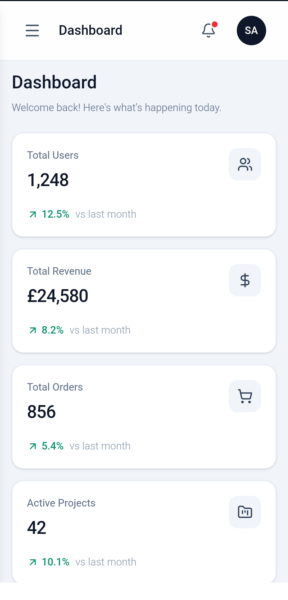
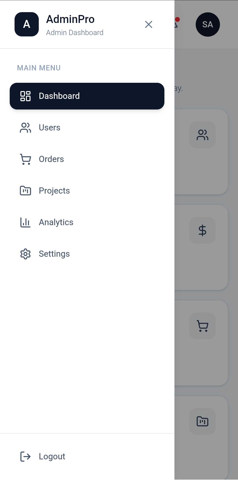
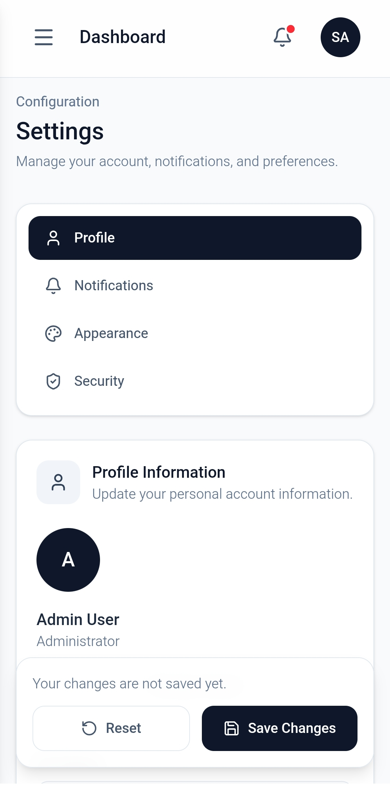

# AdminPro — React Admin Dashboard 🚀

A modern, responsive, and professional Admin Dashboard built using **React, Vite, and Tailwind CSS**.

This project was developed as part of a **Frontend Internship Task** to demonstrate practical React development, component-based architecture, reusable components, responsive UI design, React Hooks, state management, and modern frontend development practices.

---

## 🌐 Live Demo

**Live Application:**

https://admin-dashboard-2026-tau.vercel.app/

---

## 📸 Project Screenshots

The dashboard is designed with a clean and professional interface with responsive layouts for desktop and mobile devices.

### 🖥️ Desktop Dashboard

### 👥 Users Management

### 🛒 Orders

### 📁 Projects

### 📈 Analytics

### ⚙️ Settings

### 📱 Mobile Dashboard

### 📱 Mobile Sidebar

### ⚙️ Mobile Settings

## ✨ Features

- 📊 Dashboard overview with key statistics
- 👥 Users statistics
- 💰 Revenue statistics
- 🛒 Orders statistics
- 📁 Projects statistics
- 📈 Revenue analytics chart
- 👤 User profile section
- 🔔 Notifications interface
- 🔍 Search interface
- 📱 Responsive mobile sidebar
- 🖥️ Desktop, tablet, and mobile responsive design
- ✨ Smooth and lightweight UI animations
- 🎨 Clean and professional interface
- 🧩 Reusable React components
- ⚡ Fast Vite development environment
- 🧭 Interactive dashboard navigation

---

## 🛠️ Tech Stack

### Frontend

- **React**
- **JavaScript**
- **Vite**
- **Tailwind CSS**

### Libraries

- **Lucide React** — Icons
- **Recharts** — Analytics and dashboard charts

### Development & Deployment

- **ESLint**
- **Git**
- **GitHub**
- **Vercel**

---

## 🧠 React Concepts Demonstrated

This project demonstrates practical React development concepts, including:

- Functional Components
- React Hooks
- `useState`
- `useEffect`
- Component-based architecture
- Reusable UI components
- Props and component data flow
- State-driven UI interactions
- Responsive design
- Organized project structure

---

## 🧩 Component Architecture

The dashboard is divided into reusable components instead of keeping the entire interface inside one large component.

### Main Components

- `Sidebar` — Dashboard navigation
- `Navbar` — Top navigation and search
- `StatCard` — Reusable statistics cards
- `AnalyticsChart` — Revenue analytics visualization
- `ProfileCard` — User profile section
- `Notifications` — Notification interface

This component-based structure makes the application easier to maintain, update, and scale.

---

admin-dashboard/
│
├── public/
│   └── screenshots/
│       ├── desktop-dashboard.png
│       ├── desktop-users.png
│       ├── desktop-orders.png
│       ├── desktop-projects.png
│       ├── desktop-analytics.png
│       ├── desktop-settings.png
│       ├── mobile-dashboard.png
│       ├── mobile-sidebar.png
│       └── mobile-settings.png
│
├── src/
│   │
│   ├── components/
│   │   ├── AnalyticsChart.jsx
│   │   ├── Navbar.jsx
│   │   ├── Notifications.jsx
│   │   ├── ProfileCard.jsx
│   │   ├── Sidebar.jsx
│   │   └── StatCard.jsx
│   │
│   ├── data/
│   │   └── dashboardData.js
│   │
│   ├── pages/
│   │   ├── Analytics.jsx
│   │   ├── Dashboard.jsx
│   │   ├── Orders.jsx
│   │   ├── Projects.jsx
│   │   ├── Settings.jsx
│   │   └── Users.jsx
│   │
│   ├── App.jsx
│   ├── index.css
│   └── main.jsx
│
├── .gitignore
├── index.html
├── package.json
├── package-lock.json
├── vite.config.js
└── README.md